# Hi 👋, I'm Ayinkx

---

## 🚀 About Me

- 🔭 Currently contributing to Open Source projects
- 🌱 Learning **Flask, Flask API, HTML, CSS, Docker and SQL**
- 🐍 Python Developer
- 💡 Passionate about Backend Development and Automation
- 🤝 Looking to collaborate on Python and Open Source projects
- 📚 Self-taught developer who enjoys learning by building projects

---

## 💻 Tech Stack

---

## 📊 GitHub Stats

---

## 🔥 GitHub Streak

---

## 🏆 GitHub Trophies

---

## 📈 Contribution Graph

<picture>
  <source media="(prefers-color-scheme: dark)" srcset="output/github-contribution-heatmap-dark.svg" />
  <source media="(prefers-color-scheme: light)" srcset="output/github-contribution-heatmap-light.svg" />
  
</picture>

---

## 🐍 Contribution Snake

<picture>
  <source media="(prefers-color-scheme: dark)" srcset="output/github-contribution-grid-snake-dark.svg" />
  <source media="(prefers-color-scheme: light)" srcset="output/github-contribution-grid-snake.svg" />
  
</picture>

---

## 🌐 Connect With Me

---

## 💡 Current Focus

- 🚀 Building real-world Python projects
- 🌍 Contributing to Open Source
- 🧩 Strengthening Backend Development skills
- 🐳 Learning Docker
- 🌐 Improving Flask & REST API development
- 📖 Preparing to learn SQL in depth

---

## 📌 Developer Philosophy

> "Every contribution, no matter how small, is another step toward becoming a better software engineer."

---

### 👀 Profile Views

---

### ⭐ Thanks for visiting my profile!

If you like my work, consider following me and checking out my repositories.

Happy Coding! 🚀

